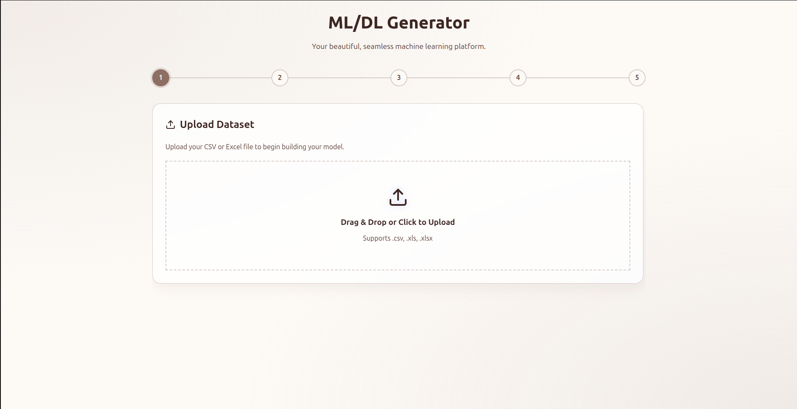
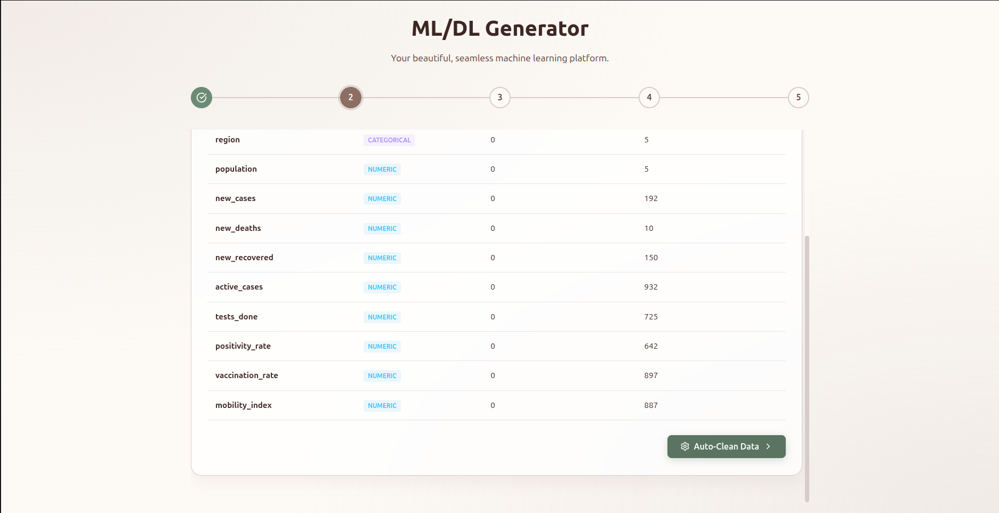
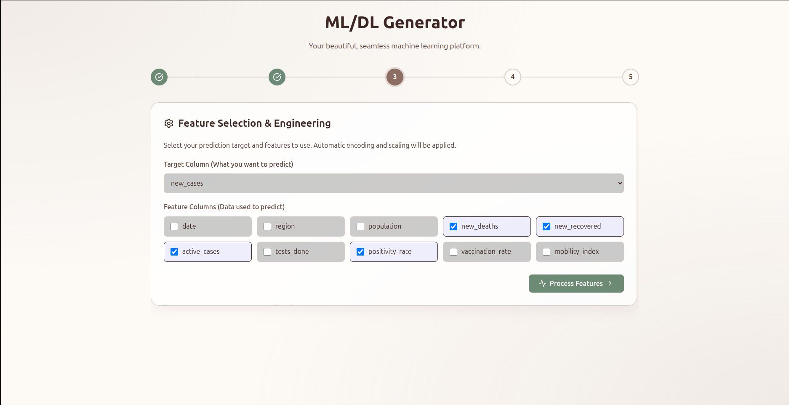
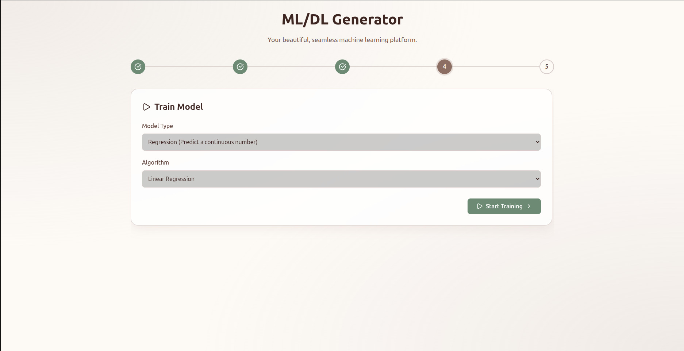
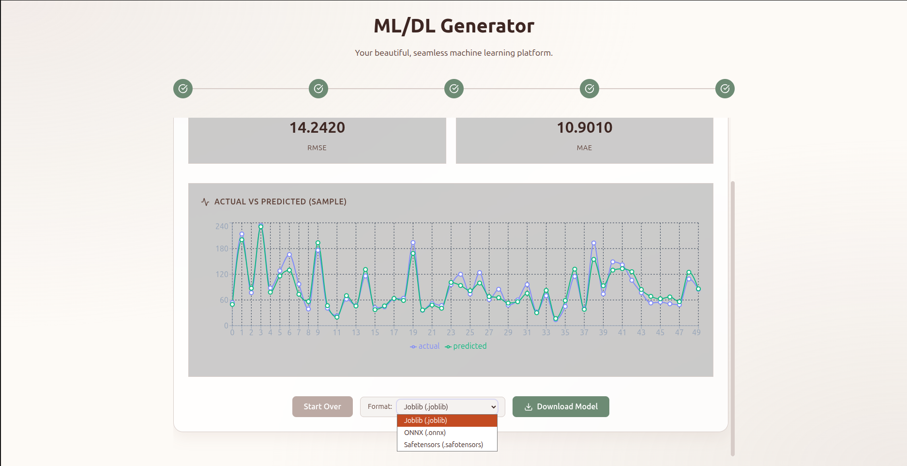

# ML/DL Generator - Fullstack ML Model Generator

ML/DL Generator is a modular, full-stack machine learning platform that allows users to upload datasets, perform automated data cleaning and feature engineering, train models, visualize performance, and download trained models.







## 🚀 Features

- **Step-by-Step Pipeline**: A guided 5-step process from data upload to model evaluation.
- **Modular Backend**: Each ML stage (loading, cleaning, engineering, etc.) is isolated in its own module for easy debugging and extensibility.
- **Automated Cleaning**: Handles missing values and duplicate rows automatically.
- **Feature Engineering**: Supports categorical encoding (Label Encoding) and numerical scaling (Standard Scaling).
- **Multiple Algorithms**:
  - **Classification**: Logistic Regression, Random Forest.
  - **Regression**: Linear Regression, Random Forest.
- **Interactive Visualizations**: Real-time charts showing "Actual vs Predicted" values using Recharts.
- **Model Export**: Download trained models and preprocessors as a unified `.joblib` file.

## 🛠 Tech Stack

- **Frontend**: React, Vite, Lucide-React, Recharts, Axios.
- **Backend**: Python, FastAPI, Scikit-learn, Pandas, Joblib.

## ⚙️ Installation & Running

### Prerequisites
- Python 3.10+
- Node.js & npm

### Getting Started

1. **Clone the repository and run setup**:
   ```bash
   chmod +x setup.sh run.sh
   ./setup.sh
   ```

2. **Start both services**:
   ```bash
   ./run.sh
   ```

### Manual Setup (Optional)

If you prefer to set up the components individually:

#### Backend
1. Navigate to `backend/`.
2. Create and activate a virtual environment:
   ```bash
   python -m venv venv
   source venv/bin/activate  # On Linux/macOS
   ```
3. Install dependencies:
   ```bash
   pip install -r requirements.txt
   ```
4. Run the server:
   ```bash
   uvicorn main:app --reload
   ```

#### Frontend
1. Navigate to `frontend/`.
2. Install dependencies:
   ```bash
   npm install
   ```
3. Run the development server:
   ```bash
   npm run dev
   ```

## 📁 Project Structure

```text
.
├── backend/
│   ├── pipeline/           # Modular ML pipeline stages
│   ├── routes/             # FastAPI API endpoints
│   ├── uploads/            # Temporary storage for uploaded files
│   ├── processed/          # Intermediate data and preprocessors
│   └── saved_models/       # Final exported model files
├── frontend/
│   ├── src/
│   │   ├── App.jsx         # Main application logic and UI
│   │   └── index.css       # Premium styling system
│   └── ...
└── run.sh                  # Root execution script
```

## 📜 License
MIT
